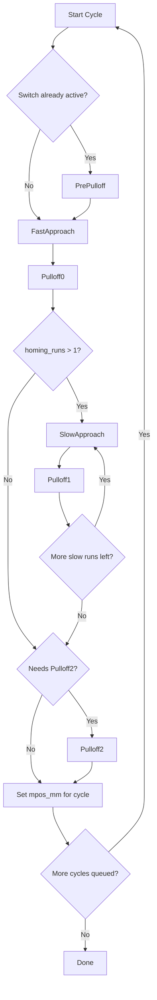

# Homing Process

Homing is the process of finding a reference position, typically at one corner of the machine's workspace.  That position is fixed to the machine itself, independent of where the working stock might be located.  Limit switches are positioned at the extents of axis or motor motion. The homing process moves the machine until those switches activate, indicating that the limit of travel has been reached.  That establishes a reference point for the "machine coordinate system" to serve as the basis for subsequent motion.

It is not strictly necessary that all machines must be homed.  It is possible to have an unhomed machine with an arbitrary machine coordinate system reference, then "touch off" to working stock to establish the reference point in "work coordinates".

## Overview

FluidNC homing works in two layers:

1. Homing consists of one or more cycles, each encompassing one or more axes.
2. Each cycle runs a fixed sequence of phases over its axes
3. Any axis can be configured so it does not participate in homing 

Axes can home together in the same cycle, or in separate cycles, depending on each axis' `homing/cycle` setting.

If you issue the `$H` "home all" command, all the cycles will run in numerical order starting with cycle 1.  You can also explicitly home an axis individually with, e.g. `$HX`, or a group of axes with, e.g. `$H=XY`.

## Phase Flow



## Homing Phases

### `PrePulloff`

If a home switch is already active when a cycle starts, FluidNC first backs away from it. If no switch is active, this phase is skipped.  PrePulloff only works if the limit switch setup is appropriate.  If an axis has a "limit_all_pin", FluidNC does not know which end of the axis is limited, so it does not know which direction to pull off.

### `FastApproach`

FluidNC makes the first move toward the home switches at the speed configured by `homing/seek_mm_per_min` . This is the fast switch-finding pass.

### `Pulloff0`

After the first switch hit, FluidNC pulls away from the switches`.

### `SlowApproach`

If `homing_runs` is greater than 1, FluidNC moves back toward the switch at the slower feed speed for a more precise locate touch.

### `Pulloff1`

FluidNC pulls away again after each slow locate touch.

### `Pulloff2`

If a dual-motor axis has different pull-off distances on the two motors, FluidNC adds one last corrective pull-off so both sides end up where they should.

### `CycleDone`

FluidNC sets the homed machine position for that cycle and either starts the next cycle or finishes homing.

## Multi-Axis Behavior

When multiple axes home in the same cycle, FluidNC plans one coordinated move, typically in a diagonal direction. If one axis hits its switch before the others, the move is stopped and replanned for the remaining axes.

## What `homing_runs` Does

The `homing_runs` setting controls how many switch touches happen in each cycle:

- `1` means a fast touch only.
- `2` means the common two-touch sequence: one fast touch and one slow touch.
- `3` to `5` add more slow touch / pull-off pairs.

The first move toward a switch uses `seek_mm_per_min`. Additional moves use `feed_mm_per_min`.

## How Motion Direction Is Chosen

Each axis uses `positive_direction` to choose whether homing moves toward the positive or negative end of travel.  If `positive_direction` is true, approach phases move in the direction of increasing coordinate value for that axis.  Pull-off phases move in the opposite direction.

## What Happens When a Switch Is Hit

During the approach phases, a switch hit tells FluidNC that one or more motors have reached home. Depending on the machine kinematics, FluidNC may stop immediately, remove completed axes or motors from the active set, and continue homing only the ones that still need to move.

## Squaring

If an axis has two motors and two limit switches, FluidNC performs "squaring" on that axis, in order to correct any "racking" (out of square) that may exist in the gantry.  During approach, typically one of the switches will activate before the other.  FluidNC stops the motor associated with that first switch, allowing the other motor to continue until its switch activates.  If the switches are aligned correctly, this will leave the gantry square to the frame.  Small amounts of switch misalignment can be compensated for by giving the switches slightly different pulloff_mm values.

There is a common misconfiguration that can lead to homing failures during axis squaring.  If the limit switches are swapped so that the switch for motor 0 is assigned to motor 1, and vice versa, then that axis will not complete homing.  In that case if, say, the left switch activates first, the right motor will stop, preventing that side of the gantry from ever reaching the switch on that side.  Meanwhile, the left motor will continue running, driving that side farther into the already-activated switch.

Another less-common squaring failure mode is when the switches are so badly misaligned that the gantry cannot twist enough to reach the second switch after the motor on the other side stops.

## What Happens on Failure

Two important failure cases are handled explicitly:

- If an approach move finishes without finding the switch, homing fails.
- If a pull-off move finishes and the switch is still active, homing fails.

In either case, FluidNC stops motion and enters an alarm condition.

## Machine Position After Homing

At the end of a cycle, FluidNC assigns the configured `mpos_mm` value to each homed axis in that cycle.

That value represents the machine coordinate after the pull-off. It is not the switch trip point.  The pull-off distance is thus "outside" of the machine working envelope.

## Completion

After the last homing cycle finishes, FluidNC:

- synchronizes the parser and planner position
- returns the machine to normal stepping mode
- enters `Idle` if all required axes are homed
- runs the `after_homing` macro, if configured

## Settings That Matter Most

Global setting:

```yaml
axes:
  homing_runs: 2
```

Per-axis homing settings:

```yaml
homing:
  cycle: 1
  positive_direction: true
  mpos_mm: 0
  seek_mm_per_min: 200
  feed_mm_per_min: 50
  settle_ms: 250
  seek_scaler: 1.1
  feed_scaler: 1.1
```

Per-motor setting that affects pull-off behavior:

```yaml
motor0:
  pulloff_mm: 1.0
```

## Typical Default Sequence

With the common default `homing_runs: 2`, one cycle usually looks like this:

1. Optional `PrePulloff`
2. `FastApproach`
3. `Pulloff0`
4. `SlowApproach`
5. `Pulloff1`
6. Optional `Pulloff2`
7. Set `mpos_mm`

That is the normal FluidNC homing pattern.

## Homing in Non-Cartesian Kinematic Systems

In a cartesian machine, motors and switches correspond to axes in an obvious manner.  A motor corresponds to one axis or one side of a multi-motor axis, with a switch for each motor or motor pair.  It is not so obvious for other kinematic systems.

CoreXY and its derivatives can be handled somewhat similarly to cartesian, except for the fact that the switches correspond to axes but not to motors.  FluidNC handles that by searching for switches as though it were a cartesian machine, planning coordinated motor activity to move the machine in the desired direction.  When a switch is reached, the motion stops and a new motion toward that cycle's remaining switches is planned, continuing until all switches have activated.

For Parallel Delta kinematics, the homing switches reflect the positions of the arms - typically the "fully up" positions.  Homing is done strictly in "arm space" without regard to the XYZ coordinate system.  Once the fully-up arm positions have been established, FluidNC sets the XYZ "mpos_mm" values as specified in the configuration, and offsets the kinematics transform accordingly.

FluidNC cannot home the WallPlotter kinematics system.  The configuration settings must reflect the cable lengths and the initial starting position must be established manually.

## Direct Motor Homing

The preceding discussion applies to axes that use switches and "infinitely-rotating" motors like steppers.  Some motors can only move over a limited (rotational or linear) range, and they typically have some built-in method to establish a known reference position.  Examples include Dynamixel motors and RC Servos.  For axes driven by such motors, homing is done by sending a command to the motor, telling it to go to the reference position.